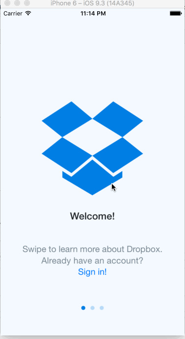

## Dropbox

The purpose of this homework is to use Xcode to implement the flow between the screens of an application. We're going to use the techniques from this week to implement the Dropbox app from the signed out state to the basic signed in state.

Time spent: 4 hours

### Features

#### Required

- [x] User can tap through the 3 welcome screens.
- [x] User can follow the create user flow.
  - [x] On the create user form, the user can tap the back button to go to the page where they can sign in or create an account.
  - [x] Before creating the account, user can choose to read the terms of service.
  - [x] After creating the account, user can view the placeholders for Files, Photos, and Favorites as well as the Settings screen.
  - [x] User can log out from the Settings screen.
- [x] User can follow the sign in flow.
  - [x] User can tap the area for "Having trouble signing in?".
  - [x] User can log out from the Settings screen.

#### Optional

- [ ] User can view a detail view for one of the files and favorite the file.
- [ ] User can actually type in the forms and tap to dismiss the keyboard.
- [ ] User can swipe through the welcome screens instead of just tapping them.
- [ ] User sees updated page indicator dots using page control.
- [ ] User can view actual Dropbox Terms of Service in a web view.
- [ ] User is presented with native action sheet to view and agree with terms of service.
- [ ] User sees updated password strength as they type in password field.

#### The following **additional** features are implemented:

- [ ] List anything else that you can get done to improve the app functionality!

Please list two areas of the assignment you'd like to **discuss further with your peers** during the next class (examples include better ways to implement something, how to extend your app in certain ways, etc):

1. Is there a way to implement this app so that I don't have to create two different flows for a new user and an existing user? (I have two duplicate tab bar view controller sets with different image content)
2. How do I implement the 'sign in' and 'create account' flows through one root view controller instead of two?

### Video Walkthrough 

Here's a walkthrough of implemented user stories:

GIF created with [LiceCap](http://www.cockos.com/licecap/).

## Notes

Describe any challenges encountered while building the app.

* Any libraries or borrowed content.
